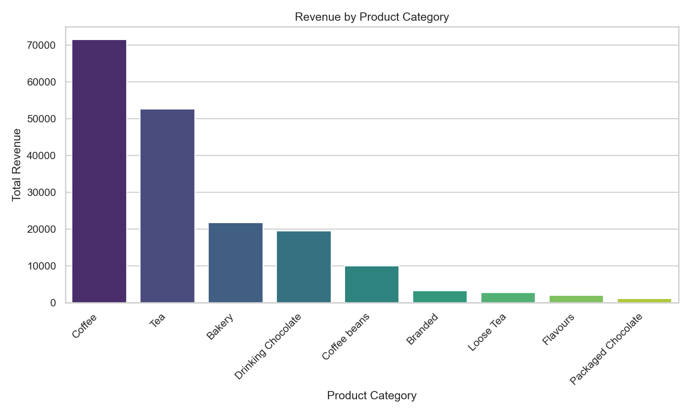
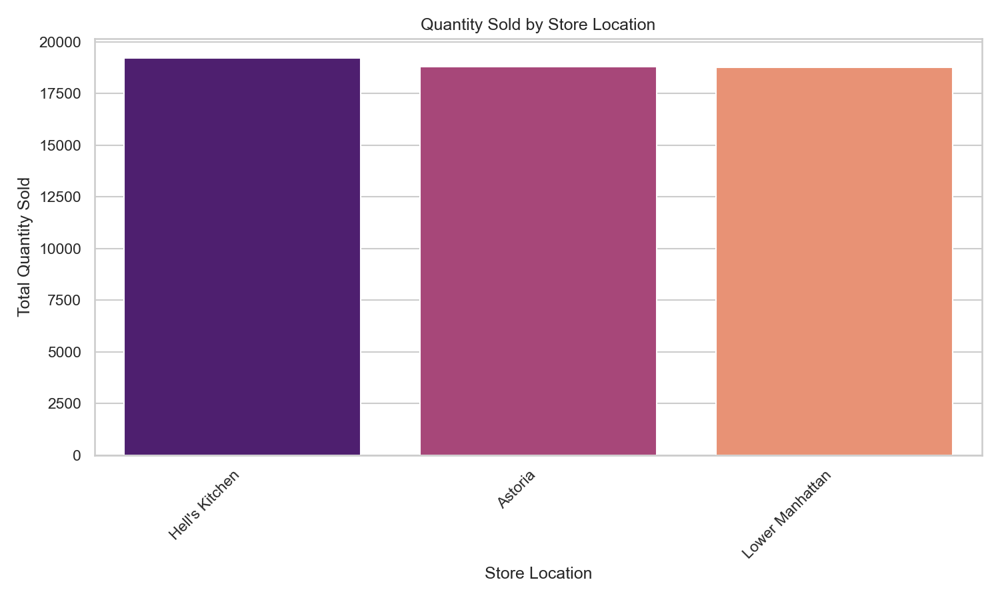
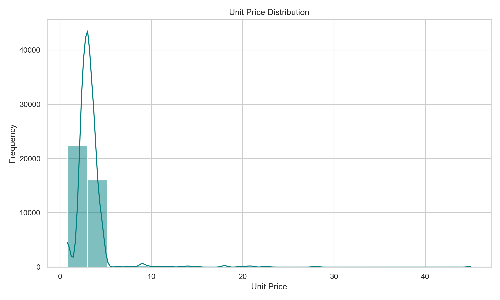
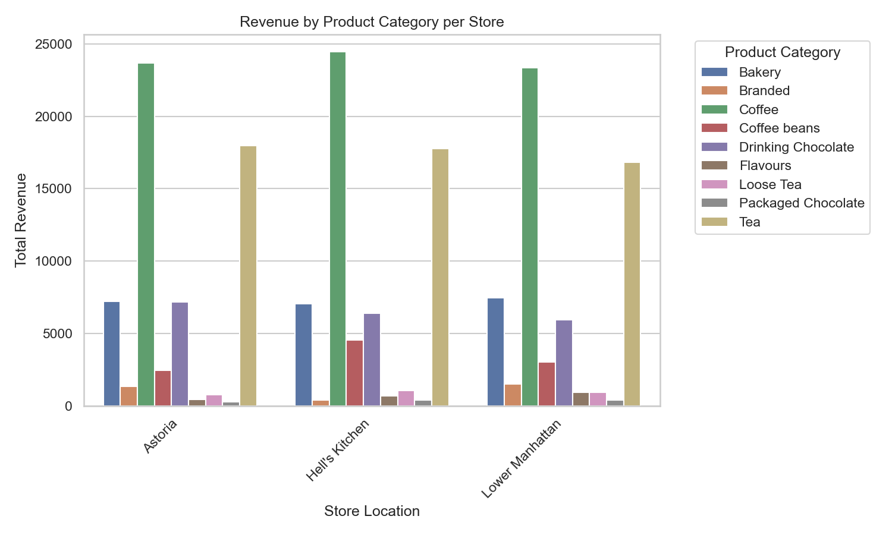

# ☕ Coffee Shop Sales Dashboard

A Python + MySQL project for managing, analyzing, and visualizing coffee shop sales data. The project provides a full CRUD console application backed by MySQL, along with Seaborn-powered chart visualizations for sales insights.

## 📁 Project Files

- [`sql.py`](./sql.py) — Main Python application: database table management, CRUD operations, CSV export, and chart visualization
- [`coffee_shop_sales.sql`](./coffee_shop_sales.sql) — SQL schema for the `coffee_shop_sales` table

## 🚀 Features

- **Table Structure Management** — Create, alter, and manage the `coffee_shop_sales` table
- **CRUD Operations** — Add, update, delete, and view sales transactions
- **CSV Export** — Export all sales records to a CSV file
- **Data Visualization** — Generate Seaborn charts directly from the MySQL database:
  - Revenue by Product Category
  - Quantity Sold by Store Location
  - Unit Price Distribution
  - Revenue by Product Category per Store

## 🛠️ Tech Stack

- Python (`mysql-connector-python`, `pandas`, `matplotlib`, `seaborn`)
- MySQL

## 📊 Dashboard Visualizations

### Revenue by Product Category


### Quantity Sold by Store Location


### Unit Price Distribution


### Revenue by Product Category per Store


## ⚙️ Setup & Usage

1. Clone the repository:
   ```bash
   git clone https://github.com/<your-username>/coffee_shop_sales.git
   cd coffee_shop_sales
   ```

2. Install dependencies:
   ```bash
   pip install mysql-connector-python pandas matplotlib seaborn
   ```

3. Set up the MySQL database using the provided schema:
   ```bash
   mysql -u root -p < coffee_shop_sales.sql
   ```

4. Update the `DB_CONFIG` dictionary in `sql.py` with your own MySQL credentials.

5. Run the application:
   ```bash
   python sql.py
   ```

6. Use the interactive console menu to add/update/delete records, export data, or generate charts.

## 📂 Repository Structure

```
coffee_shop_sales/
├── sql.py
├── coffee_shop_sales.sql
├── images/
│   ├── chart_revenue_by_category.png
│   ├── chart_quantity_by_location.png
│   ├── chart_unit_price_distribution.png
│   └── chart_revenue_by_category_per_store.png
└── README.md
```

## 📜 License

This project is open source and available under the MIT License.
---

## 👤 Author

**HARSHIT_ASWAL**  
📧 mailto://harshitaswal04@gmail.com 
🔗 [LinkedIn](https://www.linkedin.com/in/harshit-aswal) | [GitHub](https://github.com/harshitaswal04)

Feel free to open an issue or reach out if you have questions or suggestions!

---

⭐ **If you found this project helpful, please give it a star!**
